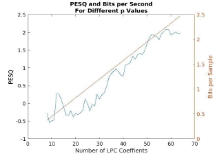
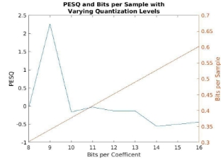
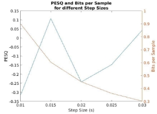
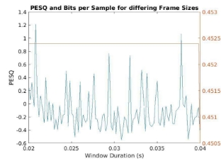

An Exploration of Linear Predictive Coding

Andrew Hoyt; Department of Electrical and Computer Engineering, Johns Hopkins University

INTRODUCTION

Linear predictive coding (LPC) is an autoregressive method for analyzing the harmonics of speech signals. It models the human glottis as an all pole filter which generates harmonics around the filter poles. In this time domain, the filter estimates a given sample of a signal as a weighted sum of all previous samples. The weights of this system can be calculated via the autocorrelation of the signal. The error between the actual sample and the estimated sample can then be used to calculate the gain of the filter via the standard deviation of the residuals sequence.

Once the LPC coefficients and gain are calculated, they can be used to synthesize speech. Given an input that is similar to the residual, applying the all pole filter described above, scaled by the gain generates a sequence that imitates the original sequence. The choice of the input depends primarily on whether the speech is voiced; there is a dominant fundamental frequency; or unvoiced; produced primarily from noise. For unvoiced speech, the excitation signal is generated by a spectrally flat uniform noise generator and for voiced speech, an impulse train with the period of the fundamental is generated.

The result of LCP analysis then is a compressed representation of the original speech signal where each LPC coefficient and gain value is represented by some number of bits.

In practice, an entire sequence isn’t processed at once but rather in frames. A primary assumption behind LPC is that the signal is stationary within an analysis frame. Therefore, in order for LPC analysis to be effective, the speech signal needs to be segmented into frames. As a result, the LPC models human speech as a time-dependent all pole filter.

METHODS

ANALYSIS

LPC analysis is conducted by first determining the steps size and frame size. This is how much time should there be between frames and how long each frame should be. For this analysis, a step size of 20ms and a frame size of 30ms is chosen. This choice of frame and step size results in an overlap of 10ms which is necessary for the reconstruction process later on.

Next the pitch is estimated via an autocorrelation method which will be discussed in more detail below. The basic assumption is that if a frame is periodic, then so will the autocorrelation. It aims to determine the distance between correlation peaks which then correspond to the fundamental frequency of the frame.

High frequency emphasis filtering is then applied. This is necessary because the LPC analysis process results in a cut of the high frequency content at a rate of 6 dB/octave [1]. This filtering process accounts for this loss. For this project, the following filter impulse response was used:

Segmented into overlapping frames and a hamming window is applied to each frame. For this process the *buffer* function in MATLAB is utilized [2]. Each frame is processed sequentially to calculate the LPC coefficients and the gain for each frame. The LPC coefficients and residual variance is calculated via the *lpc* function in MATLAB [2]. From this the filter gain is calculated as the square root of the residual variance. The maximum of the LPC coefficients, gain, and pitch are extracted and the LPC coefficients, gain, and pitch are quantized into 12 bits using their maximum as an upper threshold limit to prevent clipping.

RECONSTRUCTION

Given the LPC coefficients, gain values, and pitch information, a synthesized speech signal can be generated. The frame length and window length from the encoding step is used to split the synthesized signal into frames that are combined via an overlap and add operation. However, before this is done, the LPC coefficients, gain values, and pitch information is converted from compressed integers back into double precision floating point numbers.

Frames are synthesized in one of two ways. If the frame is unvoiced, which is represented by 0 pitch, an excitation signal made up of uniform random noise is used. If the frame is voiced, then a frame of uniform random noise is combined with an impulse train with the period of the fundamental frequency. This is done because it models human speech. The lungs generate random noise as an input. This input is then either passed to the glottis when the vocal folds are open, or the vocal fold superimposed a periodic pattern into the noise signal by rapidly opening and closing at a specified frequency. This excitation signal is then filtered by an all pole filter and scaled by the system gain for that frame. An analysis window, in this case the hamming window, is applied to the frame and it is added to the resynthesized signal.

The final step to this process is to normalize the synthesized signal This is to adjust any peaks that may be clipped once the contents are saved to a file.

VOICING ESTIMATION

The voicing of a frame can be estimated by analyzing the zero crossing rate of a given frame. This is because the zero crossing rate is correlated with the fundamental frequency of a signal. When analyzing a single frequency signal, the frequency can be calculated from the zero crossing rate since it will have exactly one zero crossing point in a period. However composite signals, such as audio complicate this. As a result, zero crossing rate can only give a rough estimate for pitch. However, this is all that is necessary for detecting pitch. If a frame has a zero crossing rate above a threshold, then it can be determined that the frame is unvoiced. Further if a frame has sufficiently low energy, then an unvoiced frame can be determined to be silence.

PITCH ESTIMATION

A more robust way of calculating the fundamental frequency within a frame is via the autocorrelation of the frame. The autocorrelation will always have a peak at a lag value of 0. However, if the frame is composed of a low enough fundamental frequency, then the autocorrelation will have periodic peaks. Therefore, the pitch of the fundamental frequency, in samples, is the degree of the lag until the first peak in the autocorrelation from here the fundamental frequency is calculated as:

Whereis the fundamental frequency,is the sampling frequency, and T is the number of samples fromto the first peak.

RESULTS

The 10 sample files provided in project 2 are processed by the LPC analysis and synthesis process described above. For the analysis, 18 poles are generated per frame, each frame is 30 ms long with a step of 20 ms between frames, and all of the values generated by the LPC process are quantized into 12 bits. These values were chosen via research and experimentation [1]. The result is comprehensible audio that has a low, gravely nature to it which is likely due to the lack of high frequency content removed via the LPC process as well as the lack of anti-resonance that is provided by the nasal cavity in human speech. The following table shows metrics that describe the audio compression via LPC analysis and the reconstructed signal quality.

TABLE 1

LPC COMPRESSION AND RECONSTRUCTION METRICS

|**ReconstructedFile**|**Bits**|**SamplesPerSecond**|**BitsPerSecond**|**CompressionRatio**|**PESQ**|
| - | - | - | - | - | - |
|output/Sample1-received.wav|20112|2765.7675|12071.12312|0.04715282467|2.16803172|
|output/Sample10-received.wav|21552|3162.94875|12128.73272|0.04737786219|2.479273097|
|output/Sample2-received.wav|20352|2834.685|12061.78464|0.04711634626|2.53091583|
|output/Sample3-received.wav|23232|3677.4|12129.61331|0.04738130201|2.017496809|
|output/Sample4-received.wav|22272|3370.995|12156.7905|0.0474874629|2.538924971|
|output/Sample5-received.wav|22512|3467.7375|12074.824|0.04716728126|2.245393141|
|output/Sample6-received.wav|23472|3757.90125|12117.31681|0.0473332688|1.849611256|
|output/Sample7-received.wav|19152|2490.96875|12147.94846|0.04745292369|2.129802509|
|output/Sample8-received.wav|22752|3536.28|12095.69378|0.04724880383|2.301134038|
|output/Sample9-received.wav|16032|1744.9575|12127.65354|0.04737364664|1.732137032|
This table shows the name of the reconstructed file, the number of bits required to represent the original file after LPC analysis, the number of samples needed to reconstruct a second of audio, the compression ratio; i.e. the ratio between the number of bits in the LPC analysis and the number of bits in the original file, and the perceptual evaluation of speech quality (PESQ) score. From this table, it can be seen that LPC does a great job of compressing the original signal, using only ~5% of the memory. Furthermore the PESQ score ranges from 1 (Bad) to 5 (excellent) [3]. From this, it can be shown that the reconstruction is not of high quality but is, however, intelligible, which for low bandwidth applications is all that is necessary.

Furthermore, LPC parameters can be optimized for a specific input. As an example, the following frame “the synthesized signal is supposed to be of high standard” is used due to the presence of a large number of fricatives. In order to determine the ideal parameters, the signal is analyzed by varying the number of coefficients, the number of bits used for quantization, the step size, and the frame size. This analysis generated the following plots.

Figure 1: Analysis of the phrase “The signal is supposed to be of high quality” by varying the number of LPC coefficients (top left), the number of bits used for quantization (top right), the step size in ms (bottom left), and the frame size (bottom right) while keeping all other parameters constant. The plots show the PESQ score on the left axis, and the bits per sample on the right axis which represent the level of compression.

The goal of this analysis was to determine which values for each parameter maximized the PESQ score while minimizing the number of bits used per sample and combining them. However, in practice, this was not an effective method of determining the ideal parameters. Better performance was determined by fine tuning with known good parameters. The following values were used

TABLE 2 IDEAL PARAMETERS

|P|18|
| - | - |
|Bits|10|
|Frame Size|0.02|
|Step Size|0.025|
|PESQ|3.2775|
|Bits per Sample|0.6274|
From table 2 it can be shown that the resulting audio file is able to produce fairly high quality speech with a high level of compression.

CONCLUSION

LPC is a method for analyzing a speech signal by modeling the resonance of the glottis. It does so via an all pole filter or an autoregressive process. This analysis can also be used to synthesize human speech given the right input. For voiced speech this would be a periodic impulse train with the frequency of the speechand uniform random noise for invoice signals. The synthesized signal is intelligible but contains noticeable artifacts such as a loss of high frequency content and a static pitch which is not present in natural human speech. However, the results are intelligible and are thus acceptable for low bandwidth applications.

REFERENCES

1. A. Alwan, "Wide Band Speech Coding with LPC", *Seas.ucla.edu*, 2002. [Online]. Available: http://www.seas.ucla.edu/spapl/projects/ee214aW2002/1/report.html?fbclid=IwAR31Ek-IzQqNA caEUB07iYiGGQ2TsP\_Zi6Qcf6x-44WG3wqqzF3ZbqTu-GI. [Accessed: 20- Nov- 2021].
1. 2021. [Online]. Available: https://www.mathworks.com/help/matlab/. [Accessed: 20- Nov- 2021].
1. "Perceptual Evaluation of Speech Quality - Wikipedia", *En.wikipedia.org*, 2021. [Online]. Available: https://en.wikipedia.org/wiki/Perceptual\_Evaluation\_of\_Speech\_Quality. [Accessed: 20- Nov- 2021].
